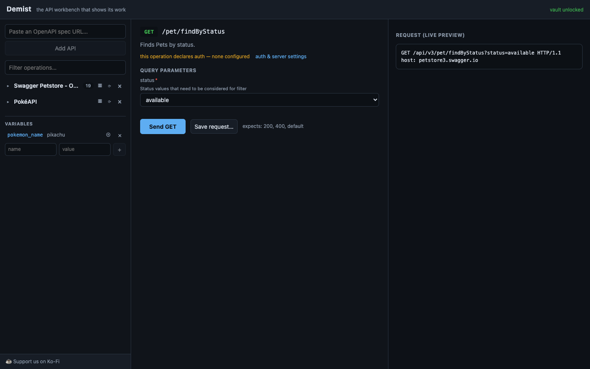

<div align="center">
  
  <h1>demist</h1>
  <p><strong>A spec-driven multi-API workbench that always shows you the raw HTTP.</strong></p>
  <p>
    <a href="LICENSE"></a>
    
    
    
    <a href="https://github.com/jermainewalkes/demist/actions/workflows/ci.yml"></a>
    <a href="https://ko-fi.com/jwalkes"></a>
  </p>
</div>

To some, APIs can feel mysterious mostly because tooling hides the plumbing. demist takes any OpenAPI or
Swagger spec — by URL or paste — and derives a humane GUI from it: operations grouped by
resource, request forms generated from the schemas and auth configured once per API, with as
many APIs as you like side by side in one workspace. Its signature habit is honesty: every
form shows a live preview of the exact HTTP it will send, and every call returns the full
request/response transcript with secrets masked.

<picture>
  <source media="(prefers-color-scheme: dark)" srcset="docs/screenshot-dark.png"/>
  
</picture>

## What it does

- **Any spec, no hand-tuning** — Swagger 2.0 and OpenAPI 3.0/3.1, JSON or YAML. Lazy,
  cycle-safe `$ref` resolution keeps huge specs fast (GitHub's 12 MB, 1,194-operation spec
  indexes in ~150 ms).
- **Forms from schemas** — parameters and request bodies render as forms with enums as
  dropdowns, required markers and inline docs.
- **The raw HTTP, always** — a live preview before you send and a byte-accurate transcript
  after; the end-to-end suite proves the transcript matches the wire.
- **Variables and chaining** — reference `{{var.name}}` or `{{secret.name}}` in any field;
  click a key in a JSON response to extract it into a variable for the next request, on any
  API in the workspace.
- **Auth derived from the spec** — API key, bearer and basic, plus OAuth2 client credentials
  (token caching) and authorisation code with PKCE (browser login, automatic refresh).
- **Capability map** — an X-ray of everything an API can do: stats, method mix and a
  clickable resource tree, derived purely from the spec.
- **Spec diffing** — compare your workspace copy against upstream with per-operation change
  notes and a one-click update.
- **Saved requests and deep links** — name a configured call for reuse; every operation has
  a shareable `#api/operation` URL.

## Security posture

demist handles credentials, so the rules are strict:

- Secrets live in a local vault encrypted with AES-256-GCM under a key derived from
  `DEMIST_VAULT_KEY`; without that variable the vault is disabled rather than falling back to
  plaintext.
- Secret values never reach the browser: auth is injected server-side and masked as
  `••••••••` in every transcript, log and preview — even when an echoing server reflects
  them back in a response body.
- The workspace file never contains secret values, only references to vault entry names.
- The server binds to `127.0.0.1` by default and is designed for single-user local use.
- Security reports go through [GitHub private vulnerability reporting](https://github.com/jermainewalkes/demist/security/advisories/new) —
  see [SECURITY.md](SECURITY.md).

## Where things live

Everything is scoped to the directory you run demist from:

| Path | What it holds |
| --- | --- |
| `demist.workspace.yaml` | your APIs, variables, saved requests and auth profile references — plain, git-friendly YAML; hand-edits are respected |
| `.demist/vault.json` | encrypted secrets (safe to exclude from backups you don't trust; never commit it) |
| `.demist/specs/` | cached copies of ingested specs, so restarts don't refetch |

```yaml
# demist.workspace.yaml
version: 1
apis:
  - id: petstore
    name: Swagger Petstore
    spec:
      url: https://petstore3.swagger.io/api/v3/openapi.json
    auth:
      scheme: api_key        # a securityScheme key from the spec
      secret: petstore_key   # the vault entry holding the value
variables:
  region: eu-west-2
```

## Install and run

From source (npm registry publish is coming — the package is built and named):

```sh
git clone https://github.com/jermainewalkes/demist && cd demist
npm install && npm run build
DEMIST_VAULT_KEY='a passphrase you keep' npm start
```

Then open http://localhost:4400 and paste a spec URL. Good first specs:
the [Petstore](https://petstore3.swagger.io/api/v3/openapi.json),
[PokéAPI](https://raw.githubusercontent.com/PokeAPI/pokeapi/master/openapi.yml) (no auth,
great for chaining) or [httpbin](https://httpbin.org/spec.json), which echoes back what it
receives so you can verify the transcript with your own eyes.

## Usage examples

**Chain two calls together.** Run PokéAPI's `pokemon_list`, click a result's `name` key in
the response tree — it fills the extract field — and save it as a variable. Open
`pokemon_retrieve`, click into the path parameter and click the variable's ⊕ in the sidebar:
`{{var.name}}` drops in and the preview rewrites itself before you send.

**Use a secret outside declared auth.** Store a token in the vault, then put
`{{secret.my_token}}` in any header field. It resolves on the wire and shows masked in
every transcript.

**Log in with OAuth2.** For a spec declaring an authorisation-code flow, open auth & server
settings, choose "authorization code", register the shown redirect URI with the provider and
click Save & Authorize — demist handles PKCE, stores tokens encrypted and refreshes them
automatically.

## Troubleshooting

- **`dquote>` in zsh when setting the vault key** — zsh eats `!` inside double quotes; use
  single quotes: `DEMIST_VAULT_KEY='Pass!word'`.
- **"Could not fetch spec: fetch failed — …"** — the tail of the message is the real cause
  (DNS, timeout, TLS). Transient failures from raw.githubusercontent.com are common; retry,
  or use a mirror such as cdn.jsdelivr.net.
- **"Vault disabled"** — start demist with `DEMIST_VAULT_KEY` set. Secrets are encrypted
  with it, so use the same key every time; a lost key means re-entering secrets.
- **Port already in use** — set `DEMIST_PORT` (and `DEMIST_HOST` stays `127.0.0.1` unless
  you know why you're changing it).
- **A spec loads with warnings** — demist renders what it can and lists the problems in the
  sidebar rather than refusing; the warnings tell you what the spec is missing.

## Development

```
packages/core     spec engine: parse, normalise and diff any Swagger 2.0 / OpenAPI 3.x document
packages/server   Fastify: ingestion, request proxy + transcripts, vault, workspace, OAuth2
packages/web      React + Vite UI; forms generated with react-jsonschema-form
packages/demist   the publishable package (esbuild bundle + web dist + bin)
scripts/e2e.ts    offline end-to-end suite — a local echo server plays the third-party API
```

```sh
npm run dev        # server on :4400 + hot-reloading UI on :5173
npm test           # unit tests (fixture-driven spec corpus in core)
npm run e2e        # proves transcript == wire, masking, OAuth2, diffing
npm run typecheck
node scripts/screenshot.mjs   # regenerates the README screenshot reproducibly
```

See [CONTRIBUTING.md](CONTRIBUTING.md) — the short version: keep it generic (derived from
the spec, never per-vendor) and never hide the HTTP.

## Accessibility

Interactive controls carry labels and `aria-label`s (including the array-editing buttons in
generated forms), colour is never the only signal for request methods or statuses, and the
UI is keyboard-navigable. Accessibility gaps are treated as bugs — please report them.

## Support

demist is free under the [MIT licence](LICENSE). If it saves you time, you can support its
development directly at **[ko-fi.com/jwalkes](https://ko-fi.com/jwalkes)** ☕ — entirely
optional, always appreciated.

## Roadmap

- npm registry publish, so `npx demist` works everywhere
- Custom form field templates (retiring the last react-jsonschema-form defaults)
- OAuth2 device-code flow for CLI-adjacent providers
- Request history with replay
- A read-only demo sandbox with allowlisted public APIs
